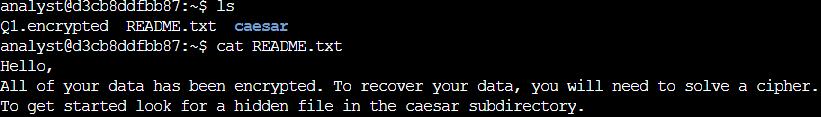
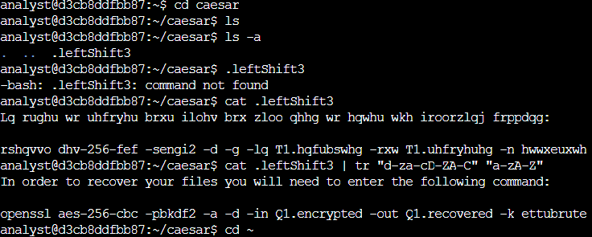
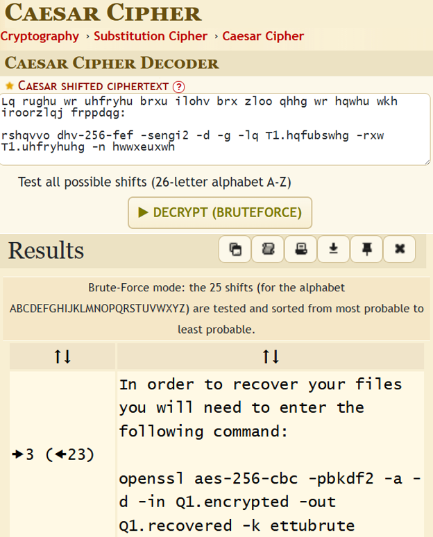
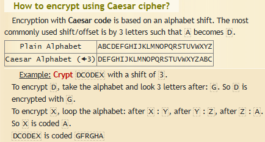
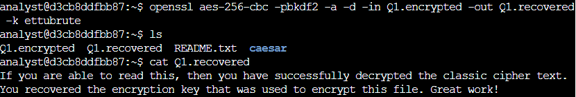

  

  

---

# Linux Decryption

## Scenario
In this scenario, all of the files in your home directory have been encrypted. You’ll need to use Linux commands to break the Caesar cipher and decrypt the files so that you can read the hidden messages they contain.  

## Tasks

**Task 1. Locate the New File** 
Commands I used:  
ls 
cat README.txt  

  

**Task 2. Identify the Encrypted File** 

Commands I used:  
cd caesar 
ls -a 
cat .leftShift3 
cat .leftShift3 | tr "d-za-cD-ZA-C" "a-zA-Z" 
cd ~  

  

**Command Breakdown** 
I feel that the scenario simulation skipped over some key information that would have been helpful for the user. The Caesar Cipher was one of the first recorded cryptographic tools used to hide (encrypt) and reveal (decrypt) messages during that time. The process was very simple and involved taking a letter and changing that letter a specified number of spaces to the left. For example, A:X, B:Y, C:Z, D:A, E:B, F:C, etc.  
This scenario gives the user the exact command line needed and even offers hints such as the "caesar" directory and ".leftShift3" hidden file. Just so I could see the decryption process, I used the online tool [dCode](https://www.dcode.fr/caesar-cipher).  
If ".leftShift3" was not the hidden file name, dCode would still have been able to see which caesar encryption technique was used since the online tool will run the encrypted text through many decryption formulas and return the most probable outcomes. 
 

  

  

**Task 3. Decrypt the File** 
Commands I used:  
openssl aes-256-cbc -pbkdf2 -a -d -in Q1.encrypted -out Q1.recovered -k ettubrute 
ls 
cat Q1.recovered 

  

**Command Breakdown** 
OpenSSL: A Linux command-line tool that is used a for a few different things. I've only used it for encryption, decryption, and hashing, but it can also be used for creating private keys and certificate creation/inquires.   
aes-256-cbc: Advanced Encryption Standard (AES)/256-bit key/Cipher Block Chaining (CBC) mode  
-pbkdf2: PBKDF2 or Password-Based Key Derivation Function 2 is a pretty common encryption algorithm that creates encryption keys from passwords through salting and hashing  
-a: Specifies that the input/output is Base64-encoded  
-d: Specifies that the function needed is to decrypt. "-e" is the opposite function: encrypt  
-in Q1.encrypted: Specifies the input file  
-out Q1.recovered: Specifies the output file. This is also creating a new file  
-k ettubrute: This specifies that the password is "ettubrute"  

**Resource Used** 
[dCode](https://www.dcode.fr/caesar-cipher) - dCode has encryption/decryption tools, converters, calculators, and numerous other tools that I have used for my other learning and university projects. I highly recommend the site.

--- 
