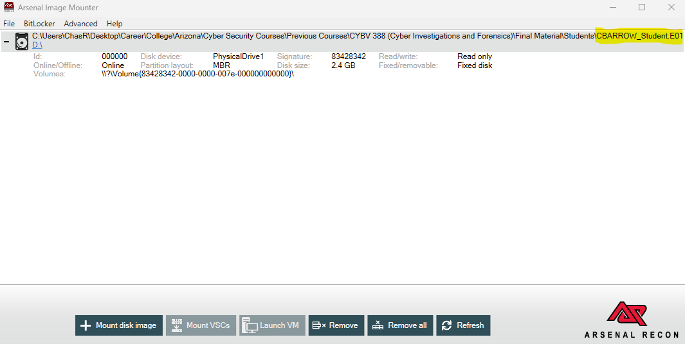
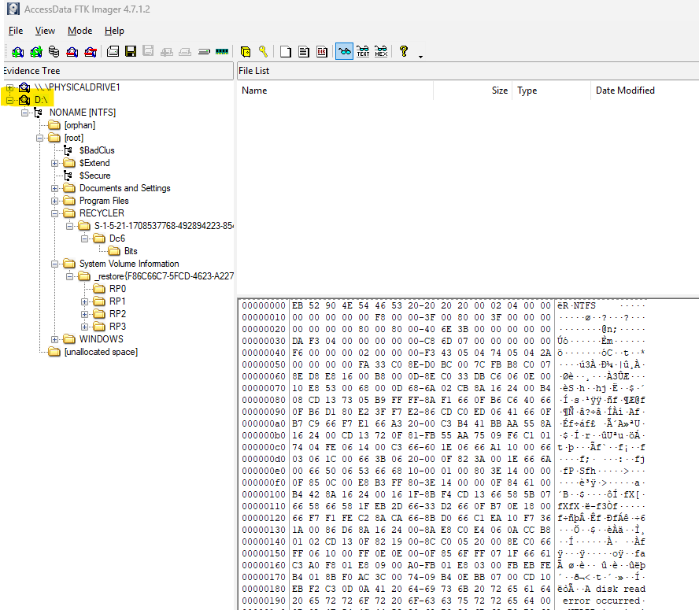
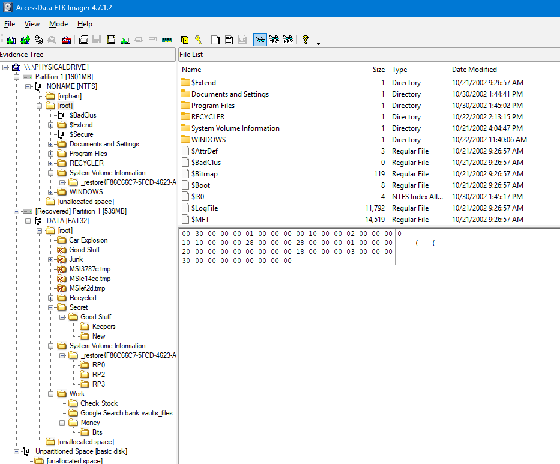
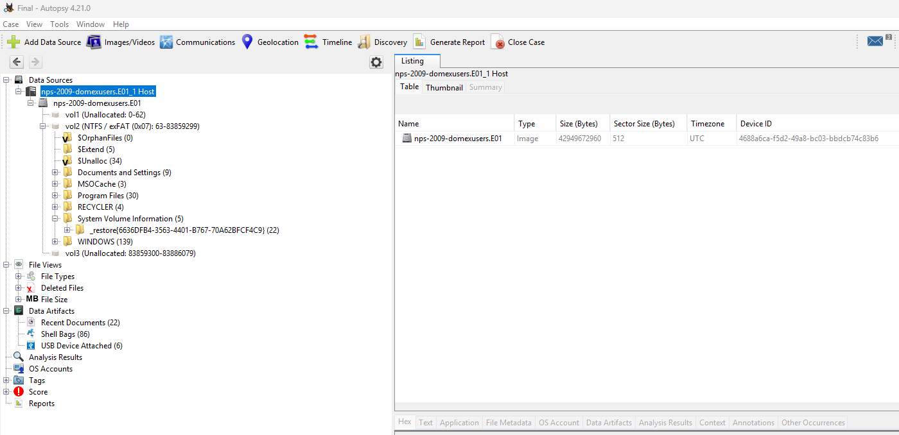
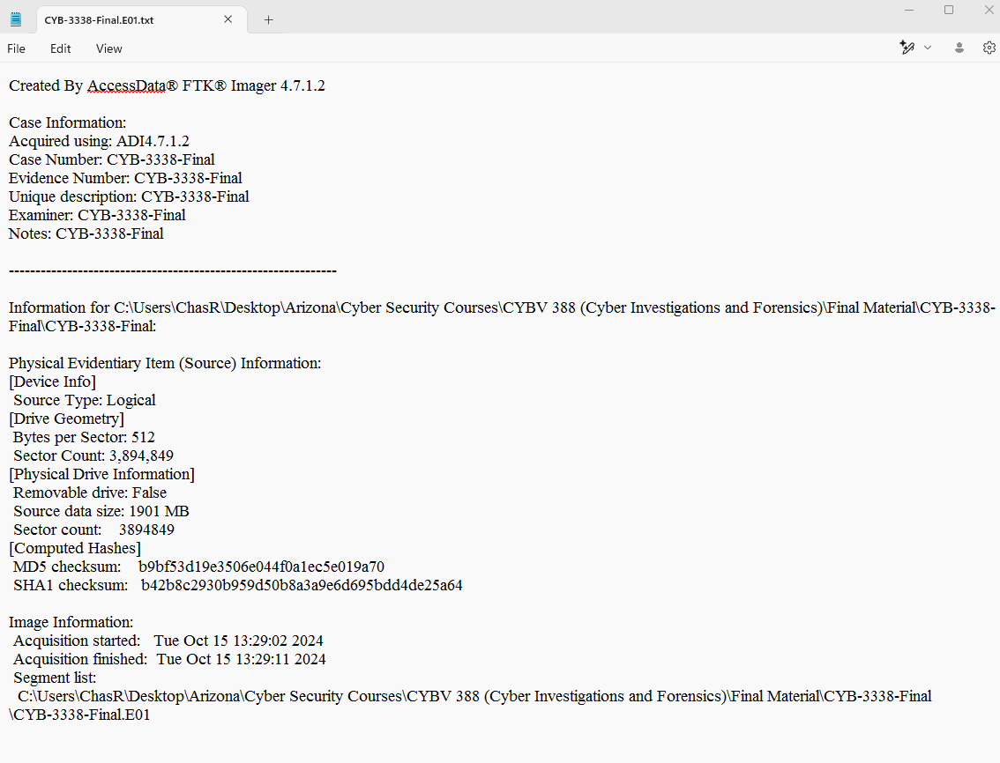
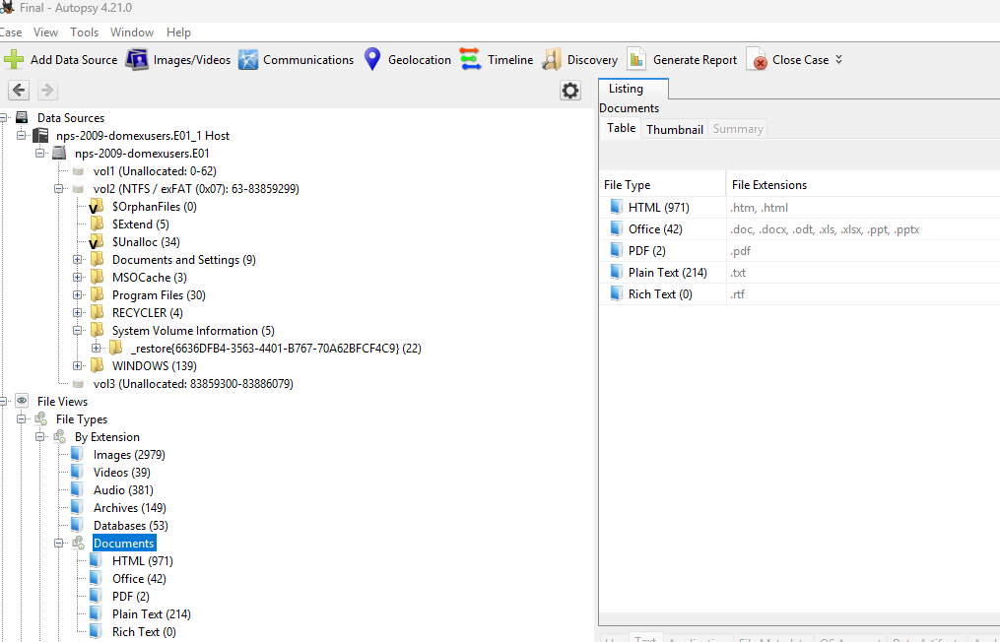
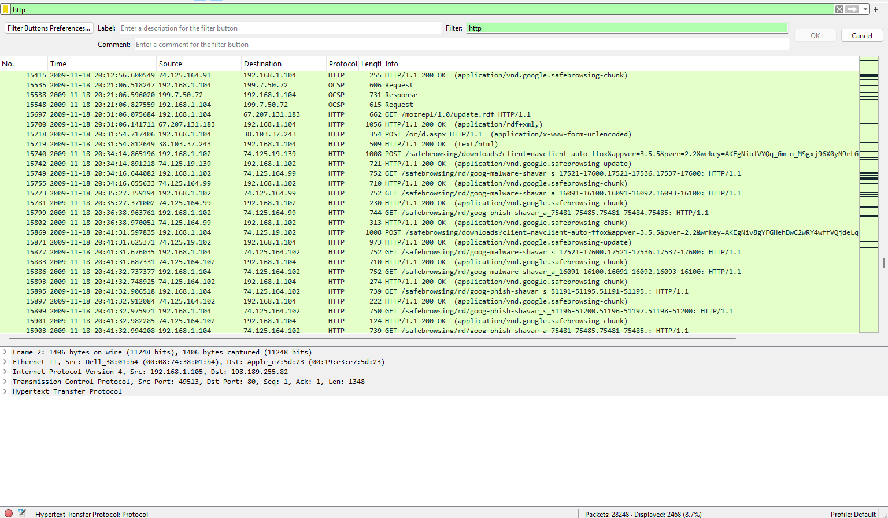

  

  

---

### Corporate Network Breach Investigation

In this exercise, I was tasked with investigating a cybersecurity breach within a corporate network. The network in question was compromised, and my goal was to identify the source of the breach, analyze the affected systems, and gather digital evidence to support the investigation.

#### Objectives:

1. **Mounting the Forensic Image:**
   - **Tool Used:** Arsenal Image Mounter
   - **Task:** Mount the forensic image “CBARROW_Student.E01” using the default settings.

2. **Adding the Logical Device with FTK Imager:**
   - **Tool Used:** FTK Imager
   - **Task:** Add the Logical device mounted with Arsenal Image Mounter and export the forensic image in E01 format with specified settings.
 

3. **Adding the Physical Device with FTK Imager:**
   - **Tool Used:** FTK Imager
   - **Task:** Remove the current device and add the physical device mounted with Arsenal Image Mounter, then export the forensic image in E01 format with specified settings.

4. **Creating a New Autopsy Case:**
   - **Tool Used:** Autopsy
   - **Task:** Create a new Autopsy case using “nps-2009-domexusers.e01” as a data source and let the case finish building.

5. **Adding and Running Hash Lookup in Autopsy:**
   - **Tool Used:** Autopsy
   - **Task:** Add the hash set named “CYBV-388-Final-Hashset” and run the ingest module with selected hash lookup.

6. **Processing Files with Exiftool:**
   - **Tool Used:** Exiftool
   - **Task:** Export files found by Autopsy and process them using Exiftool to extract metadata.

7. **Analyzing Network Traffic with Wireshark:**
   - **Tool Used:** Wireshark
   - **Task:** Open Wireshark and analyze the affiliated network traffic.

---

### Conclusion:
I identified the source of the breach and gathered digital evidence to support my conclusion. Each tool I used gave me valuable data, which helped me thoroughly investigate the breach. This project boosted my skills with forensic tools like Arsenal Image Mounter, FTK Imager, Autopsy, Exiftool, and Wireshark, and also gave me skillsets that could help me in other similar cybersecurity scenarios.

---

## Skills Demonstrated

- Data Acquisition
- Analysis
- Network Forensics
- Memory Forensics
- Registry Analysis
