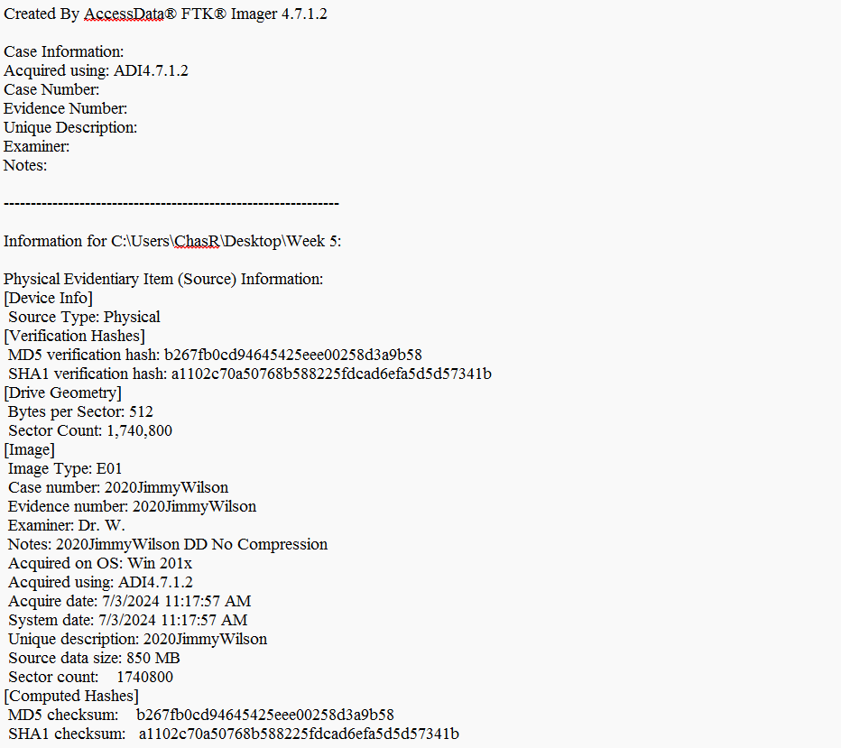
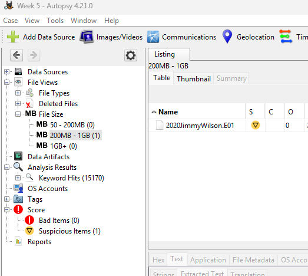
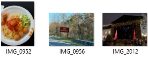
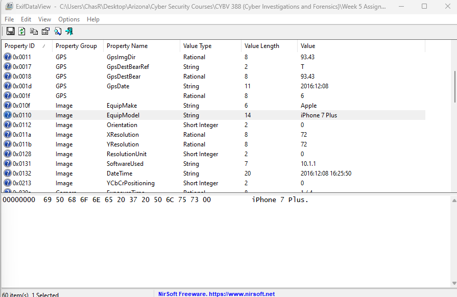
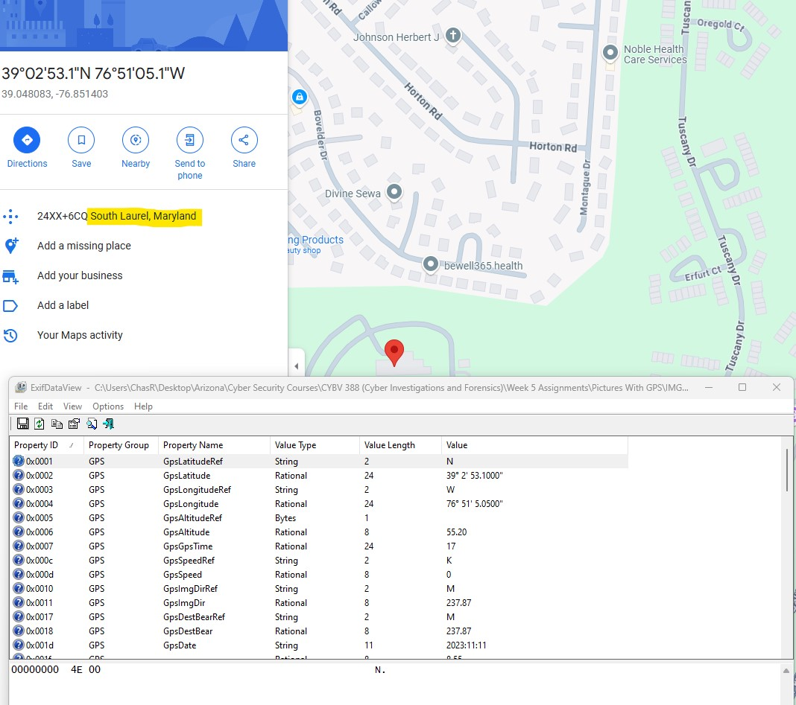
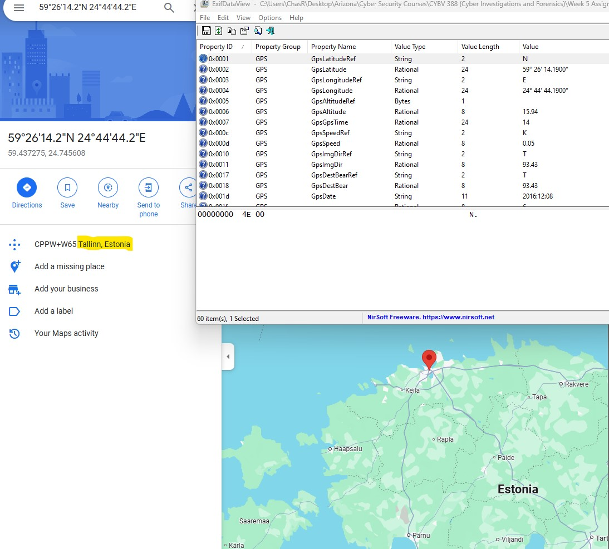
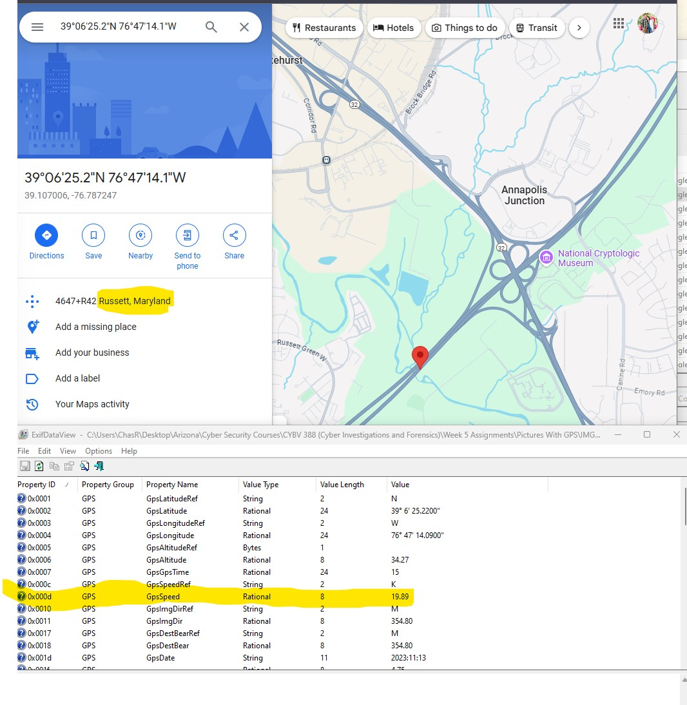

  

  

---

## Digital Forensic Analysis and Suspect Linkage

In this exercise, I was tasked with conducting a digital forensics investigation on a recovered hard drive suspected to belong to an individual involved in a series of cybercrimes. The hard drive in question was found at a crime scene and contains potential evidence that could link the suspect to various criminal activities. 

#### Objectives:

1. **Create a Forensic Image of the Disk using FTK Imager:**
   - **Tool Used:** FTK Imager
   - **Task:** Upon creating an image of the disk, ensure validity by verifying hash values. 

2. **Open Forensic Image open with Autopsy:**
   - **Tool Used:** Autopsy
   - **Task:** Use Autopsy to analyze the forensic image and extract all images stored on the hard drive. 

3. **Extracting Metadata from Images using ExifDataView:**
   - **Tool Used:** ExifDataView
   - **Task:** Use ExifDataView to extract metadata from the images recovered from the hard drive. Focus on obtaining date, time, personal information, and GPS coordinates. 
 
These three images were identified. 

Example of metadata collected from one of the images. 
4. **Linking Evidence to the Suspect:**
   - **Objective:** Analyze the extracted metadata to identify the date, time, personal information, and location data that could link the suspect to the crime scene and activities. 
With each photo, I used the coordinate values found to tie the suspect to the locations of the crimes committed. 
 
Location: South Laurel, Maryland 
 
Location: Tallinn, Estonia 
 
Location: Russett, Maryland

---

### Conclusion
In concluding the assignment, I created a forensic image, analyzed the data, and extracted the needed metadata that could potentially link the suspect to various cybercrimes. I was very surprised to see how much data is located in the photos we take. With the metadata pulled from these photos, I was able to link the suspect to each location at the time of the crimes. I used the tools FTK Imager, Autopsy, and ExifDataView to gather, analyze, and extract the data/metadata. This simulated scenario experience had a lot of moving parts and led me down a few rabbit holes, but gave me a solid foundation for future digital investigations.

---

## Skills Demonstrated

- Data Acquisition
- Analysis
- Network Forensics
- Memory Forensics
- Registry Analysis
- Metadata Extraction
- Evidence Linkage

---

## Tools Used
- FTK Imager
- Autopsy
- ExifDataView
