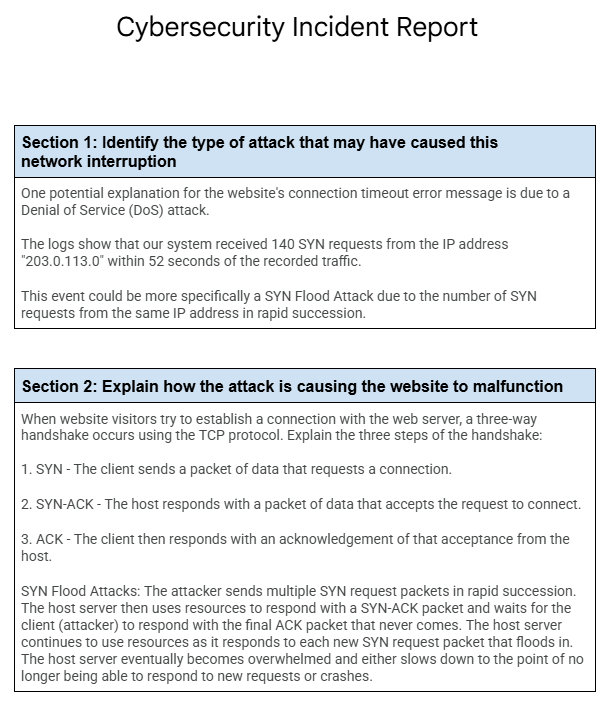

  

  

---

# Analyze Network Attack

## Scenario
You work as a security analyst for a travel agency that advertises sales and promotions on the company’s website. The employees of the company regularly access the company’s sales webpage to search for vacation packages their customers might like. 
  
One afternoon, you receive an automated alert from your monitoring system indicating a problem with the web server. You attempt to visit the company’s website, but you receive a connection timeout error message in your browser.
  
You use a packet sniffer to capture data packets in transit to and from the web server. You notice a large number of TCP SYN requests coming from an unfamiliar IP address. The web server appears to be overwhelmed by the volume of incoming traffic and is losing its ability to respond to the abnormally large number of SYN requests. You suspect the server is under attack by a malicious actor. 
  
You take the server offline temporarily so that the machine can recover and return to a normal operating status. You also configure the company’s firewall to block the IP address that was sending the abnormal number of SYN requests. You know that your IP blocking solution won’t last long, as an attacker can spoof other IP addresses to get around this block. You need to alert your manager about this problem quickly and discuss the next steps to stop this attacker and prevent this problem from happening again. You will need to be prepared to tell your boss about the type of attack you discovered and how it was affecting the web server and employees.
  

## Steps Taken:
1: **Gather Traffic Data** 
To investigate, we need to inspect the data in transit to get a better understanding of why the connection is timing out.
- To do this, we use a  network analyzer tool like Wireshark to inspect the data packets.

2: **Analyze Traffic Data** 
- A large number of TCP SYN requests are coming from the IP address "203.0.113.0".
- In the 52 seconds of recorded traffic, our system received 140 SYN requests from the IP address "203.0.113.0"  

3: **Determine Reason for Connection Timing Out** 
- The traffic shows numerous SYN requests and it's reasonable to assume our organization's system is currently being attacked
- Based on the information available to us, this is most likely a Denial of service attack (DoS), but more specifically, a SYN Flood Attack.
  

4: **Immediate Course of Action** 
The most important action to take once an active threat/attack has been discovered is to minimize the immediate impact of the active attack and then return the availability of the asset (in this case, the company website).
- **Take the server offline**: This solution is only temporary, but it allowes the system to return back to its normal operating functions. If this attack were more serious, this step would still be the most crucial when it comes to stopping attack and preventing further damage.
- **Block the IP Address**: Also temporary, but blocking the IP address "203.0.113.0" by configuring the company’s firewall will stop the abnormal number of SYN requests and bring back the availability of the company's website. 

5: **Permenant Solution** 
Blocking an IP's access will only slow down the attacker. The moment they realize their IP address is being blocked, they can also change or spoof their IP address to continue further attacks. At this point, it's best to notify your CISO/team leader/manager for permenant solutions.
- Spoofing an IP address can be as simple as using a VPN or changing the user's server location within their VPN application.

6: **Recommendations** 
Although outside the scope of the scenario, I'd like to offer permenant solutions that could be implemented to mitigate further DoS attacks in the future. - MITRE ATT&CK recommends filtering upstream network traffic by utilizing Content Delivery Networks (CDN). CDN's can block source addresses, block targeted ports, and block the protocols used for transport.
- MITRE ATT&CK also recommends using SYN Cookies to prevent SYN Flood Attacks. SYN Cookies slightly alters the way a system handles TCP handshakes. The host encodes essential information (client's initial sequence number, a secret key, and a timestamp). The server will not use resources on SYN requests until the final ACK packet is received and the server has verified that the SYN cookie is legitimate. 

**Reference Used**: [MITRE ATT&CK: Endpoint Denial of Service](https://attack.mitre.org/techniques/T1499/)
