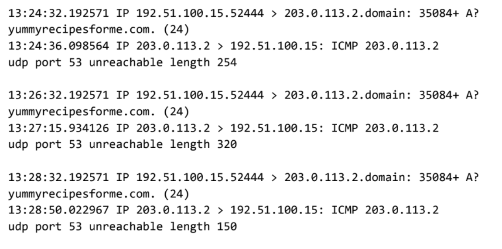
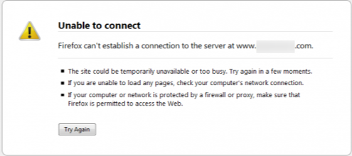
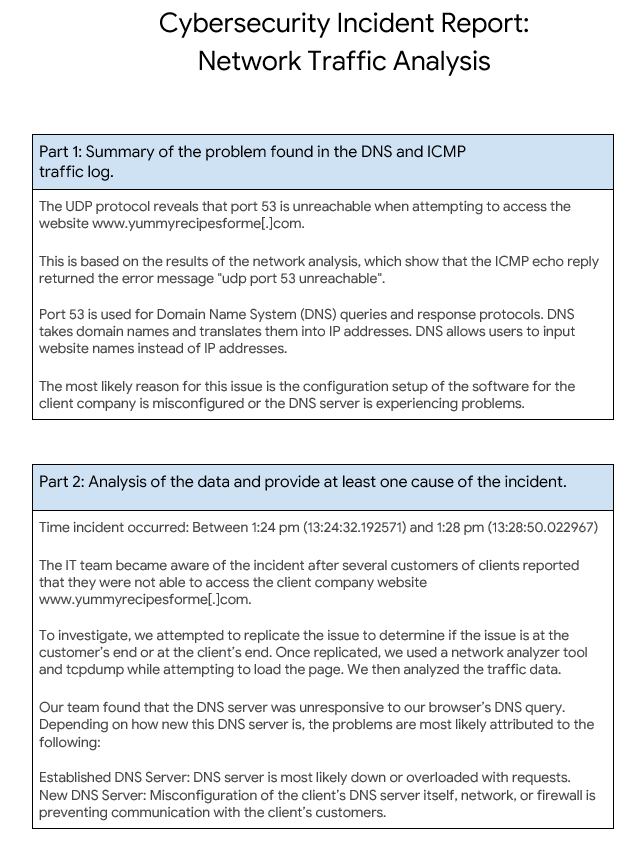

  

  

---

# Cybersecurity Incident Report: Network Traffic Analysis

## Scenario
You are a cybersecurity analyst working at a company that specializes in providing IT services for clients. Several customers of clients reported that they were not able to access the client company website www[.]yummyrecipesforme[.]com and saw the error “destination port unreachable” after waiting for the page to load. 

## Information Found Within tcpdump Log  
  
- The first two lines of the log file show the initial outgoing request from your computer to the DNS server requesting the IP address of yummyrecipesforme[.]com. This request is sent in a UDP packet.
- The third and fourth lines of the log show the response to your UDP packet. In this case, the ICMP 203.0.113.2 line is the start of the error message indicating that the UDP packet was undeliverable to port 53 of the DNS server.
- In front of each request and response, you find timestamps that indicate when the incident happened. In the log, this is the first sequence of numbers displayed: 13:24:32.192571. This means the time is 1:24 p.m., 32.192571 seconds.
- After the timestamps, you will find the source and destination IP addresses. In the first line, where the UDP packet travels from your browser to the DNS server, this information is displayed as: 192.51.100.15 > 203.0.113.2.domain. The IP address to the left of the greater-than (>) symbol is the source address, which, in this example, is your computer’s IP address. The IP address to the right of the greater-than (>) symbol is the destination IP address. In this case, it is the IP address for the DNS server: 203.0.113.2.domain. For the ICMP error response, the source address is 203.0.113.2, and the destination is your computer's IP address, 192.51.100.15.
- After the source and destination IP addresses, there can be several additional details like the protocol, port number of the source, and flags. In the first line of the error log, the query identification number appears as "35084". The plus sign after the query identification number indicates there are flags associated with the UDP message. The "A?" indicates a flag associated with the DNS request for an A record, where an A record maps a domain name to an IP address. The third line displays the protocol of the response message to the browser: "ICMP," which is followed by an ICMP error message.
- The error message "udp port 53 unreachable" is mentioned in the last line. Port 53 is a port for DNS service. The word "unreachable" in the message indicates that the UDP message requesting an IP address for the domain "www[.]yummyrecipesforme[.]com" did not go through to the DNS server because no service was listening on the receiving DNS port.
- The remaining lines in the log indicate that ICMP packets were sent two more times, but the same delivery error was received both times. 

## Steps Taken:
1. **Determine which end the issue occurs** 
To investigate, we attempted to replicate the issue to determine if the issue is at the customer’s end or the client’s end.
  - This technique simply assesses whether the issue is occurring on the customer's end or the client's end. This step is vital because it reduces the possible issues to half. Because our team was able to replicate the same problem, we now know the problem is attributed to the client. 

2. **Utilize network analyzer tools**
Once replicated, we used the network analyzer tools Wireshark and tcpdump while attempting to load the page.
  - This step is important because we are able to visually see the exact steps our computer took to establish a connection with the DNS server. This information replaces the generic response of "Unable to connect" that our browser is telling us. 

4. **Analyze the traffic data**
The traffic shows multiple attempts of our UDP data packets attempting to contact the DNS server on port 53. However, the DNS server was unresponsive to our browser’s DNS queries when attempting to resolve the web server's domain name.

5. **Determine Cause**
Lastly, we developed the most likely cause through the process of elimination
  - **Must be client side**: The customer and our system ran into the same issue. We also have to assume our system is functioning correctly. 
  - **Webpage is not the issue**: The DNS server not responding prevents any connection from being created, meaning the HTTPS request is never sent to begin with. 
  - **DNS Server or System Configuration is responsible**: All communication attempts end here.

6. **Follow up Team**
There are a few possibilities as to why this issue is occurring. The scenario had many details, and the investigation/correction portion is left to another team, I'd like to elaborate more on what the next team should be trying to identify.
  - Determine previous trends of the client's system
    - Is the client's company system well established or new?
    - Has the client's company recently implemented any significant updates or additions to their digital security systems or operational programs?
Assuming the client hasn't made any recent changes to their digital security systems or operational programs, the issue then falls on their DNS server.
  - **Established DNS Server**: DNS server is most likely down or overloaded with requests.
  - **New DNS Server**: Misconfiguration of the client’s DNS server itself, network, or firewall is preventing communication with the client’s customers. 
  
