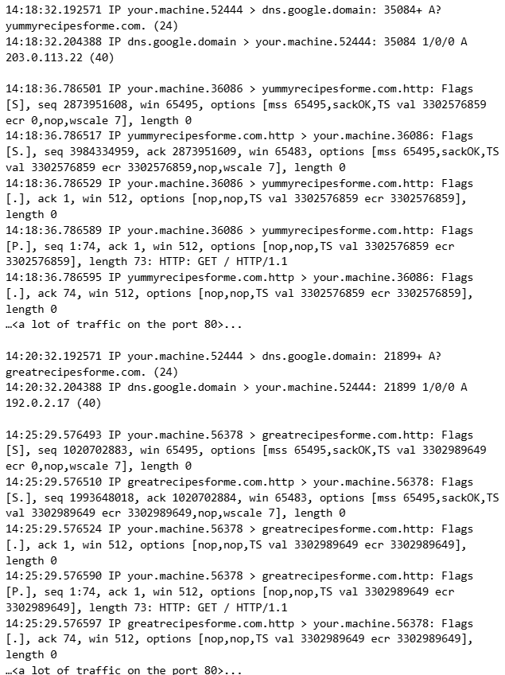
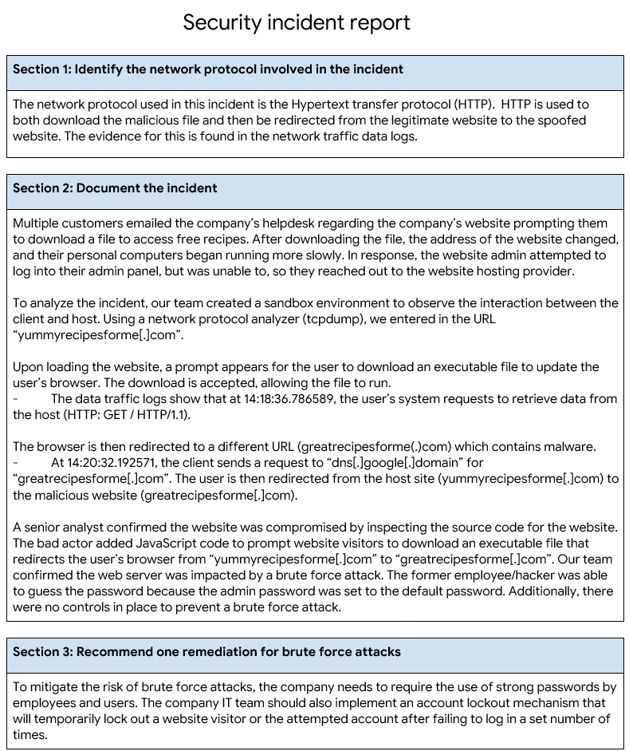

  

  

---

# Applying OS Hardening Techniques

## Scenario
You are a cybersecurity analyst for yummyrecipesforme[.]com, a website that sells recipes and cookbooks. A former employee has decided to lure users to a fake website with malware.  

The former employee/hacker executed a brute force attack to gain access to the web host. They repeatedly entered several known default passwords for the administrative account until they correctly guessed the right one. After they obtained the login credentials, they were able to access the admin panel and change the website’s source code. They embedded a javascript function in the source code that prompted visitors to download and run a file upon visiting the website. After embedding the malware, the hacker changed the password to the administrative account. When customers download the file, they are redirected to a fake version of the website that contains the malware.  
Several hours after the attack, multiple customers emailed yummyrecipesforme’s help desk. They complained that the company’s website had prompted them to download a file to access free recipes. The customers claimed that, after running the file, the address of the website changed and their personal computers began running more slowly.  
In response to this incident, the website owner tries to log in to the admin panel but is unable to, so they reach out to the website hosting provider. You and other cybersecurity analysts are tasked with investigating this security event.  
Your job is to document the incident in detail, including identifying the network protocols used to establish the connection between the user and the website. You should also recommend a security action to take to prevent brute force attacks in the future.  

## Steps Taken From Incident Response Team
1: **Create Sandbox Environment** 
- A sandbox environment is important for replicating real-world scenarios or incidents.  A sandbox environment is a protected location that is cut off from the rest of your system. This gives you the freedom to examine or run dangerous malware without the threat of damage to your system. 

2: **Use Network Protocol Analyzer** 
- Run the network protocol analyzer tcpdump, then type in the URL "yummyrecipesforme[.]com". to observe traffic data. 

3: **Review Logs** 
- The browser initiates a DNS request: It requests the IP address of the yummyrecipesforme[.]com URL from the DNS server.
- The DNS replies with the correct IP address.
- The browser initiates an HTTP request: It requests the yummyrecipesforme[.]com webpage using the IP address sent by the DNS server.
- The browser initiates the download of the malware.
- The browser initiates a DNS request for greatrecipesforme[.]com.
- The DNS server responds with the IP address for greatrecipesforme[.]com.
- The browser initiates an HTTP request to the IP address for greatrecipesforme[.]com. 

 

4: **Identify the Network Protocol Involved in the Incident** 
- The network protocol used in this incident is the Hypertext transfer protocol (HTTP). HTTP is used to both download the malicious file and then redirect from the legitimate website to the spoofed website. The evidence for this is found in the network traffic data logs. 

5: **Document the Incident** 
Multiple customers emailed the company’s help desk regarding the company’s website, prompting them to download a file to access free recipes. After downloading the file, the address of the website changed, and their personal computers began running more slowly. In response, the website admin attempted to log into their admin panel but was unable to, so they reached out to the website hosting provider. 

To analyze the incident, our team created a sandbox environment to observe the interaction between the client and host. Using a network protocol analyzer (tcpdump), we entered the URL “yummyrecipesforme[.]com”. 

Upon loading the website, a prompt appears for the user to download an executable file to update the user’s browser. The download is accepted, allowing the file to run. 
-	The data traffic logs show that at 14:18:36.786589, the user’s system requests to retrieve data from the host (HTTP: GET / HTTP/1.1). 

The browser is then redirected to a different URL (greatrecipesforme(.)com), which contains malware.  
-	At 14:20:32.192571, the client sends a request to “dns[.]google[.]domain” for “greatrecipesforme[.]com”. The user is then redirected from the host site (yummyrecipesforme[.]com) to the malicious website (greatrecipesforme[.]com). 

A senior analyst confirmed the website was compromised by inspecting the source code for the website. The bad actor added JavaScript code to prompt website visitors to download an executable file that redirects the user’s browser from “yummyrecipesforme[.]com” to “greatrecipesforme[.]com”. Our team confirmed that the web server was impacted by a brute force attack. The former employee/hacker was able to guess the password because the admin password was set to the default password. Additionally, there were no controls in place to prevent a brute force attack.  

6: **Recommend Remediation for Brute Force Attacks** 
To mitigate the risk of brute force attacks, the company needs to require the use of strong passwords by employees and users. The company IT team should also implement an account lockout mechanism that will temporarily lock out a website visitor or the attempted account after failing to log in a set number of times.  

--- 
