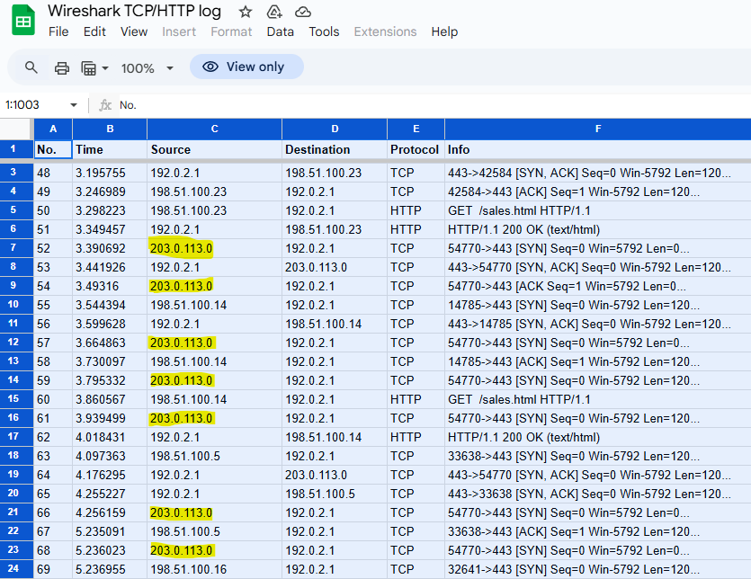

  

  

---

# Applying OS Hardening Techniques

## Scenario
You are a cybersecurity analyst for yummyrecipesforme[.]com, a website that sells recipes and cookbooks. A former employee has decided to lure users to a fake website with malware.  

The former employee/hacker executed a brute force attack to gain access to the web host. They repeatedly entered several known default passwords for the administrative account until they correctly guessed the right one. After they obtained the login credentials, they were able to access the admin panel and change the website’s source code. They embedded a javascript function in the source code that prompted visitors to download and run a file upon visiting the website. After embedding the malware, the hacker changed the password to the administrative account. When customers download the file, they are redirected to a fake version of the website that contains the malware.  

Several hours after the attack, multiple customers emailed yummyrecipesforme’s help desk. They complained that the company’s website had prompted them to download a file to access free recipes. The customers claimed that, after running the file, the address of the website changed and their personal computers began running more slowly.  

In response to this incident, the website owner tries to log in to the admin panel but is unable to, so they reach out to the website hosting provider. You and other cybersecurity analysts are tasked with investigating this security event.  

To address the incident, you create a sandbox environment to observe the suspicious website behavior. You run the network protocol analyzer tcpdump, then type in the URL for the website, yummyrecipesforme[.]com. As soon as the website loads, you are prompted to download an executable file to update your browser. You accept the download and allow the file to run. You then observe that your browser redirects you to a different URL, greatrecipesforme[.]com, which contains the malware.  

## The logs show the following process:
1. The browser initiates a DNS request: It requests the IP address of the yummyrecipesforme[.]com URL from the DNS server.
2. The DNS replies with the correct IP address.
3. The browser initiates an HTTP request: It requests the yummyrecipesforme[.]com webpage using the IP address sent by the DNS server.
4. The browser initiates the download of the malware.
5. The browser initiates a DNS request for greatrecipesforme[.]com.
6. The DNS server responds with the IP address for greatrecipesforme[.]com.
7. The browser initiates an HTTP request to the IP address for greatrecipesforme[.]com.

1: **Gather Traffic Data** 
To investigate, we need to inspect the data in transit to get a better understanding of why the connection is timing out.
- To do this, we use a  network analyzer tool like Wireshark to inspect the data packets.

2: **Analyze Traffic Data** 
- A large number of TCP SYN requests are coming from the IP address "203.0.113.0".
- In the 52 seconds of recorded traffic, our system received 140 SYN requests from the IP address "203.0.113.0"  

3: **Determine Reason for Connection Timing Out** 
- The traffic shows numerous SYN requests and it's reasonable to assume our organization's system is currently being attacked
- Based on the information available to us, this is most likely a Denial of service attack (DoS), but more specifically, a SYN Flood Attack.
  

4: **Immediate Course of Action** 
The most important action to take once an active threat/attack has been discovered is to minimize the immediate impact of the active attack and then return the availability of the asset (in this case, the company website).
- **Take the server offline**: This solution is only temporary, but it allowes the system to return back to its normal operating functions. If this attack were more serious, this step would still be the most crucial when it comes to stopping attack and preventing further damage.
- **Block the IP Address**: Also temporary, but blocking the IP address "203.0.113.0" by configuring the company’s firewall will stop the abnormal number of SYN requests and bring back the availability of the company's website. 

5: **Permenant Solution** 
Blocking an IP's access will only slow down the attacker. The moment they realize their IP address is being blocked, they can also change or spoof their IP address to continue further attacks. At this point, it's best to notify your CISO/team leader/manager for permenant solutions.
- Spoofing an IP address can be as simple as using a VPN or changing the user's server location within their VPN application.

6: **Recommendations** 
Although outside the scope of the scenario, I'd like to offer permenant solutions that could be implemented to mitigate further DoS attacks in the future. - MITRE ATT&CK recommends filtering upstream network traffic by utilizing Content Delivery Networks (CDN). CDN's can block source addresses, block targeted ports, and block the protocols used for transport.
- MITRE ATT&CK also recommends using SYN Cookies to prevent SYN Flood Attacks. SYN Cookies slightly alters the way a system handles TCP handshakes. The host encodes essential information (client's initial sequence number, a secret key, and a timestamp). The server will not use resources on SYN requests until the final ACK packet is received and the server has verified that the SYN cookie is legitimate. 

