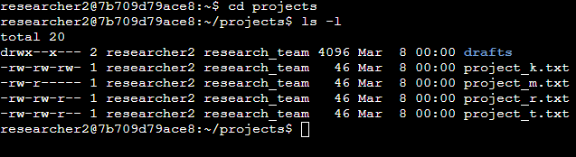
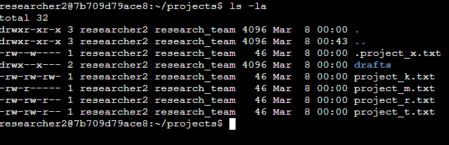
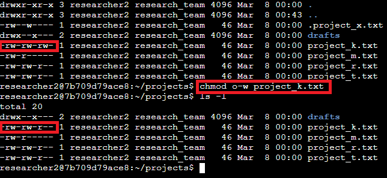
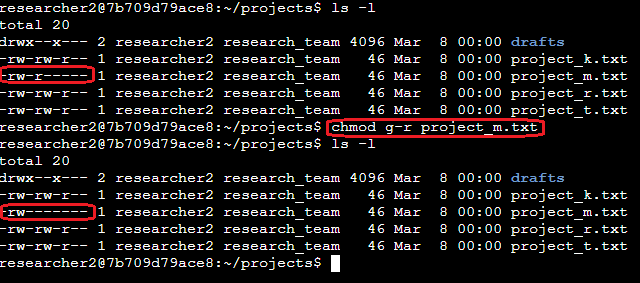
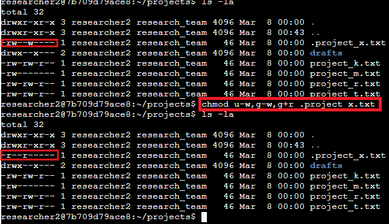
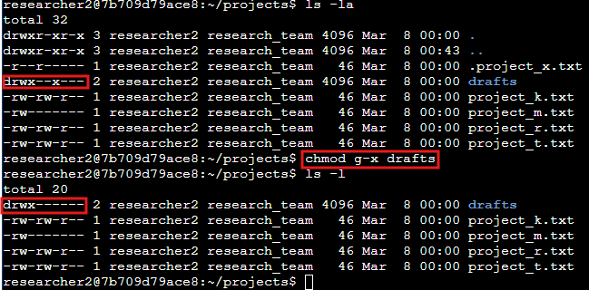

  

  

---

# Managing Authorization/File permissions in Linux

## Scenario
You are a security professional at a large organization. You mainly work with their research team. Part of your job is to ensure users on this team are authorized with the appropriate permissions. This helps keep the system secure. Your task is to examine existing permissions on the file system. You’ll need to determine if the permissions match the authorization that should be given. If they do not match, you’ll need to modify the permissions to authorize the appropriate users and remove any unauthorized access.  

## Tasks Given
1: **Check file and directory details** 
- Navigate to the projects directory.
- List the contents and permissions of the projects directory. 

 
- Check whether any hidden files exist in the projects directory. 

 
2: **Change file permissions** 
- Check whether any files in the projects directory have write permissions for the owner type of other. 
- Change the permissions of the file identified in the previous step so that the owner type of other doesn’t have write permissions. 

 
- The file project_m.txt is a restricted file and should not be readable or writable by the group or other; only the user should have these permissions on this file. List the contents and permissions of the current directory and check if the group has read or write permissions. 
- Use the chmod command to change permissions of the project_m.txt file so that the group doesn’t have read or write permissions. 

 
3: **Change file permissions on a hidden file** 
- Check the permissions of the hidden file .project_x.txt and answer the question that follows. 
- Change the permissions of the file .project_x.txt so that both the user and the group can read, but not write to, the file. 

 

 
4: **Change directory permissions** 
- Check the permissions of the drafts directory and answer the following question. 
- Remove the execute permission for the group from the drafts directory. 

 
5: **Conclusion** 
After a few hours of practice and then this practical application scenario using a Linux Bash shell, I was able to;
- Examine file and directory permissions
- Change permissions on files
- Change permissions on directories

--- 
