

  

  

---

# SQL Failed Login Attempts Investigation

## Scenario
In this scenario, you need to obtain specific information about employees, their machines, and the departments they belong to from the database. 
Your team needs data to investigate potential security issues and to update computers. 
You are responsible for filtering the required information from the database.  
Here’s how you’ll do this task:
- First, you’ll retrieve all failed login attempts after business hours.
- Second, you’ll retrieve all login attempts that occurred on specific dates.
- Third, you’ll retrieve logins that didn't originate in Mexico.
- Fourth, you’ll retrieve information about certain employees in the Marketing department.
- Fifth, you’ll retrieve information about employees in the Finance or the Sales department.
- Finally, you’ll obtain information about employees who are not in the Information Technology department.  

## Tasks
First, I needed to log into the organization's SQL database.  
Command I used:  
sudo mysql organization  

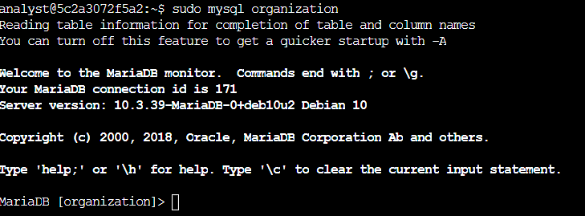  

**Task 1. Retrieve after hours failed login attempts** 
Your team is investigating failed login attempts that were made after business hours. You want to retrieve this information from the login activity. You’ll identify all unsuccessful attempts after 18:00.  

Command I used:  
SELECT * 
FROM log_in_attempts 
WHERE login_time > '18:00' AND success = 0;  

Question Given: How many failed login attempts occurred after 18:00? 
My Answer: 19  

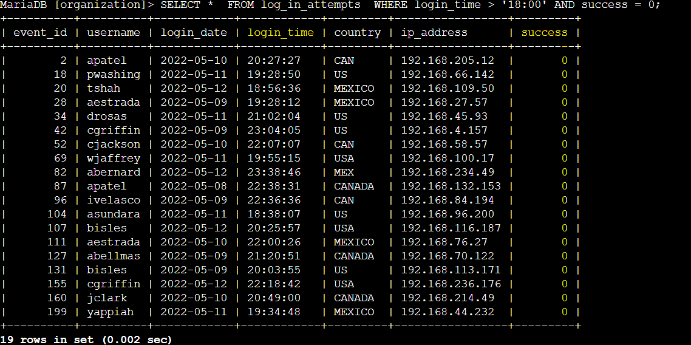  

**Task 2. Retrieve login attempts on specific dates** 
Our team is investigating a suspicious event that occurred on '2022-05-09'. You want to retrieve all login attempts that occurred on this day and the day before ('2022-05-08').  

Command I used:  
SELECT *  
FROM log_in_attempts  
WHERE login_date = '2022-05-09' OR login_date = '2022-05-08';  

Question Given: How many login attempts were made on these two days? 
My Answer: 75  

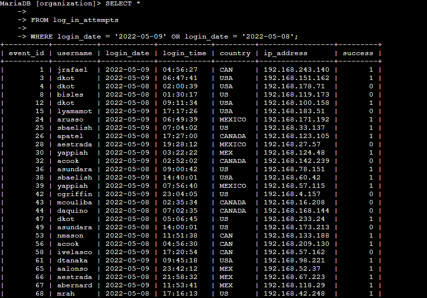 
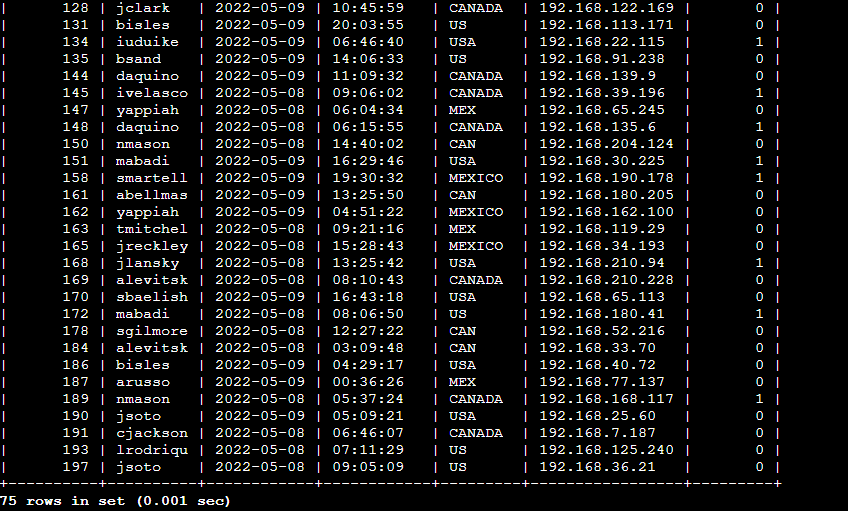  

**Task 3. Retrieve login attempts outside of Mexico** 
Now, your team is investigating logins that did not originate in Mexico, and you need to find this information.  *Note that the country field includes entries with 'MEX' and 'MEXICO'. You should use the NOT and LIKE operators and the matching pattern 'MEX%'.  

Command I used:  
SELECT *  
FROM log_in_attempts 
WHERE NOT country LIKE 'MEX%';  

Question Given: How many login attempts were made outside of Mexico? 
My Answer: 144  

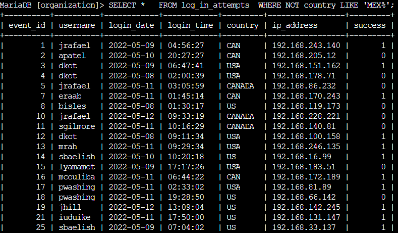 
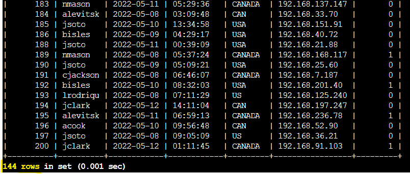  

**Task 4. Retrieve employees in Marketing** 
Your team is updating employee machines, and you need to obtain the information about employees in the 'Marketing' department who are located in all offices in the East building (such as 'East-170' or 'East-320').  

To see which categories (foreign key tables) were located within the database, I needed to view all data listed in the "employees" key.  

Command I used:  
SELECT *  
FROM employees; 

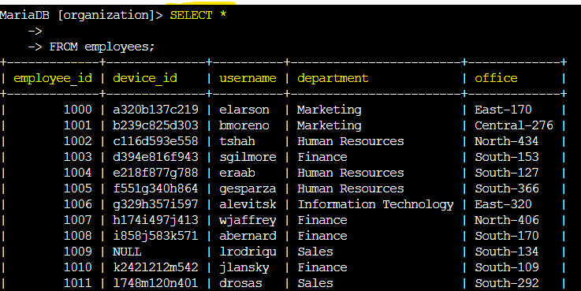  

Question Given: What is the username of the first employee in the Marketing department in the East building? 
My Answer: elarson  

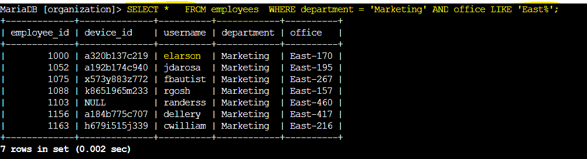  

**Task 5. Retrieve employees in Finance or Sales** 
Now, your team needs to perform a different update to the computers of all employees in the 'Finance' or the 'Sales' department, and you need to locate information on these employees.
  

Command I used:  
SELECT *  
FROM employees 
WHERE department = 'Finance' OR department = 'Sales';  

Question Given: What is the username of the first employee in the Sales department returned by the query? 
My Answer: lrodriqu  

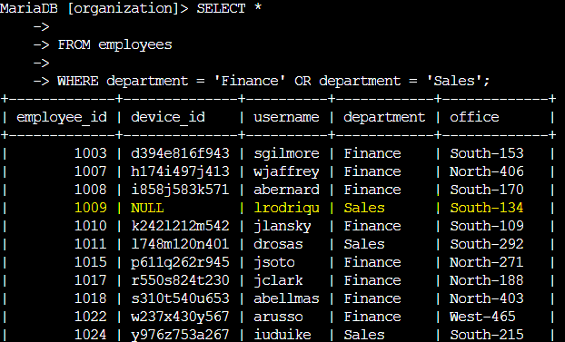  

**Task 6. Retrieve all employees not in IT** 
Your team needs to make one more update. This update was already made to employee computers in the 'Information Technology' department. The team needs information about employees who are not in that department. You should use the NOT operator to identify these employees.  
Command I used:  
SELECT *  
FROM employees 
WHERE NOT department = 'Information Technology';  

Question Given: How many employees are not in the Information Technology department? 
My Answer: 161  

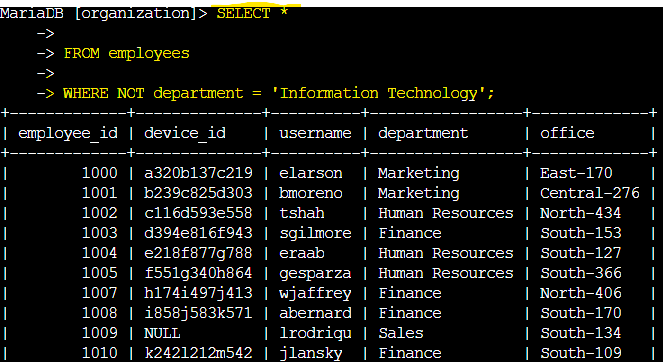 
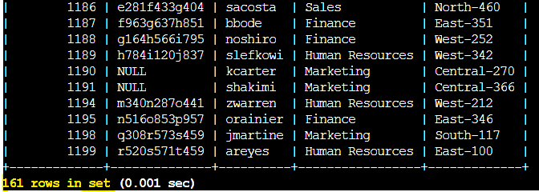  
--- 
