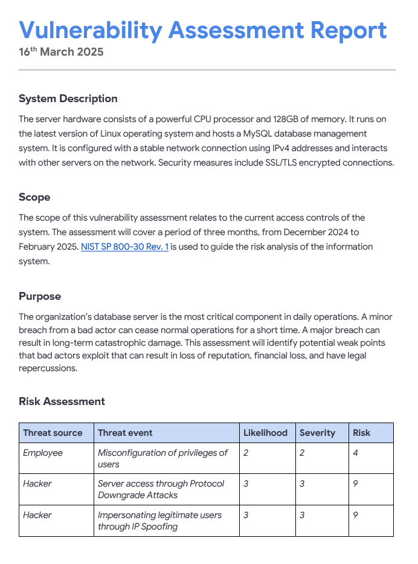
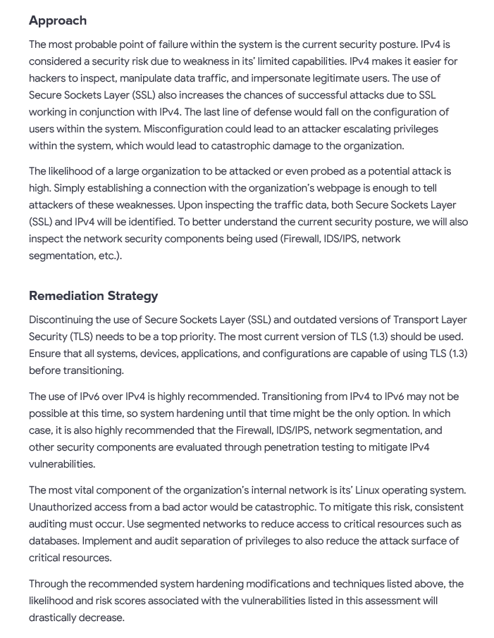

  

  

---

# Vulnerability Assessment Report of a Large Business

## Scenario
Due to recent concerns regarding an organization's security posture, they seek an in-depth evaluation of its server infrastructure and network security to identify potential vulnerabilities. The current system comprises robust hardware with a powerful CPU and 128GB of memory, running on the latest version of the Linux operating system. It hosts a MySQL database management system, which serves as the backbone for critical operations. Communication between systems is facilitated using IPv4 addresses, with SSL/TLS encrypted connections ensuring data security. 
The system interacts with other servers on the internal network and employs multiple security layers, including firewalls and Intrusion Detection Systems (IDS). Access controls are in place, but the organization requests a thorough review to ensure that user privileges are properly configured and aligned with best practices. Additionally, they aim to evaluate their network segmentation strategy and assess the feasibility of transitioning to more secure protocols and configurations. 
Given the importance of the database server to daily operations, the organization is particularly concerned about safeguarding it from unauthorized access. Provide three vulnerabilities that will mitigate risks to protect against both minor disruptions and catastrophic breaches.  

## Report Breakdown  

**System Description** 
The server hardware consists of a powerful CPU processor and 128GB of memory. It runs on the latest version of Linux operating system and hosts a MySQL database management system. It is configured with a stable network connection using IPv4 addresses and interacts with other servers on the network. Security measures include SSL/TLS encrypted connections.  

My Thought Process: 
Accessing the hardware of the organization's system, I recognized that a powerful CPU (specs unknown, so I will assume that I am the individual who deemed the CPU as powerful) and 128 gigs of RAM is recommended for larger businesses. The Linux OS is also up to date with the latest version and the organization hosts a MySQL database management system. Multiple security layers are being used such as IDS and firewalls, however, the data traffic between systems uses IPv4 routing with SSL/TLS encryption. Through the lens of an attacker, if I wanted to gain unauthorized access to the organization's internal network, I would prioritize my focus on the vulnerabilities associated with IPv4 routing with SSL/TLS encryption.(  

**Scope** 
The scope of this vulnerability assessment relates to the current access controls of the system. The assessment will cover a period of three months, from December 2024 to February 2025. NIST SP 800-30 Rev. 1 is used to guide the risk analysis of the information system.  

**Purpose** 
The organization’s database server is the most critical component in daily operations. A minor breach from a bad actor can cease normal operations for a short time. A major breach can result in long-term catastrophic damage. This assessment will identify potential weak points that bad actors exploit that can result in loss of reputation, financial loss, and have legal repercussions.  

My Thought Process: 
Due to the size of the organization and the fact that they are hosting a large database server, it's safe to assume that a bad actor is more likely to target them over smaller buisnesses. Whether the goal is to gather intelligence to assist in a follow up attack elsewhere or within the organization itself, mitigating a potential cyber attack should be the organization's top priority.  

**Risk Assessment** 

| Threat Source | Threat Event                             | Likelihood | Severity | Risk |
|---------------|------------------------------------------|------------|----------|------|
| Employee      | Misconfiguration of privileges of users | 2          | 2        | 4    |
| Hacker        | Server access through Protocol Downgrade Attacks | 3          | 3        | 9    |
| Hacker        | Impersonating legitimate users through IP Spoofing | 3          | 3        | 9    |

 
My Thought Process: 
I placed the vulnerabilities in order of precedence. The most severe damage will come from lack of correct configuration within the internal system's Linux operating system. Once an attacker has the privileges of an admin/root user, anything and everything can be enacted in the system. This vulnerability is also the easiest risk to reduce. The following two vulnerabilities regard the security controls implemented to keep unauthorized users out of the system. They will also be the most challenging to harden.  

**Approach** 
The most probable point of failure within the system is the current security posture. IPv4 is considered a security risk due to weakness in its’ limited capabilities. IPv4 makes it easier for hackers to inspect, manipulate data traffic, and impersonate legitimate users. The use of Secure Sockets Layer (SSL) also increases the chances of successful attacks due to SSL working in conjunction with IPv4. The last line of defense would fall on the configuration of users within the system. Misconfiguration could lead to an attacker escalating privileges within the system, which would lead to catastrophic damage to the organization.  
The likelihood of a large organization to be attacked or even probed as a potential attack is high. Simply establishing a connection with the organization’s webpage is enough to tell attackers of these weaknesses. Upon inspecting the traffic data, both Secure Sockets Layer (SSL) and IPv4 will be identified. To better understand the current security posture, we will also inspect the network security components being used (Firewall, IDS/IPS, network segmentation, etc.).  

**Remediation Strategy** 
Discontinuing the use of Secure Sockets Layer (SSL) and outdated versions of Transport Layer Security (TLS) needs to be a top priority. The most current version of TLS (1.3) should be used. Ensure that all systems, devices, applications, and configurations are capable of using TLS (1.3) before transitioning.    
The use of IPv6 over IPv4 is highly recommended. Transitioning from IPv4 to IPv6 may not be possible at this time, so system hardening until that time might be the only option. In which case, it is also highly recommended that the Firewall, IDS/IPS, network segmentation, and other security components are evaluated through penetration testing to mitigate IPv4 vulnerabilities.    
The most vital component of the organization’s internal network is its’ Linux operating system. Unauthorized access from a bad actor would be catastrophic. To mitigate this risk, consistent auditing must occur. Use segmented networks to reduce access to critical resources such as databases. Implement and audit separation of privileges to also reduce the attack surface of critical resources.    
Through the recommended system hardening modifications and techniques listed above, the likelihood and risk scores associated with the vulnerabilities listed in this assessment will drastically decrease.    

## Report   

 
 

--- 
