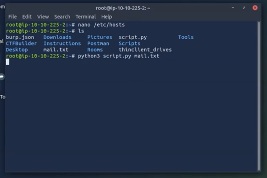
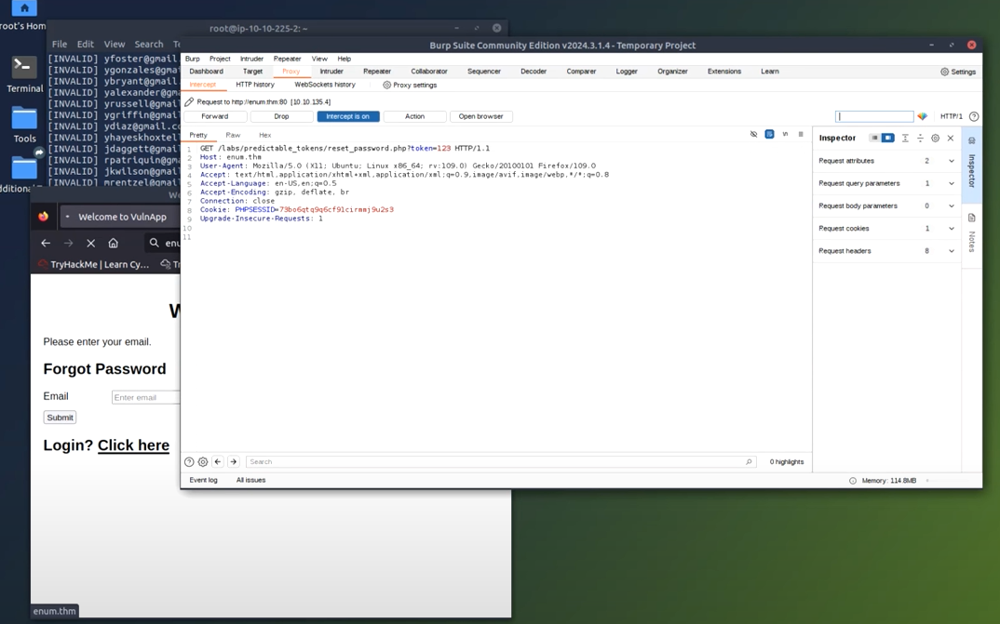
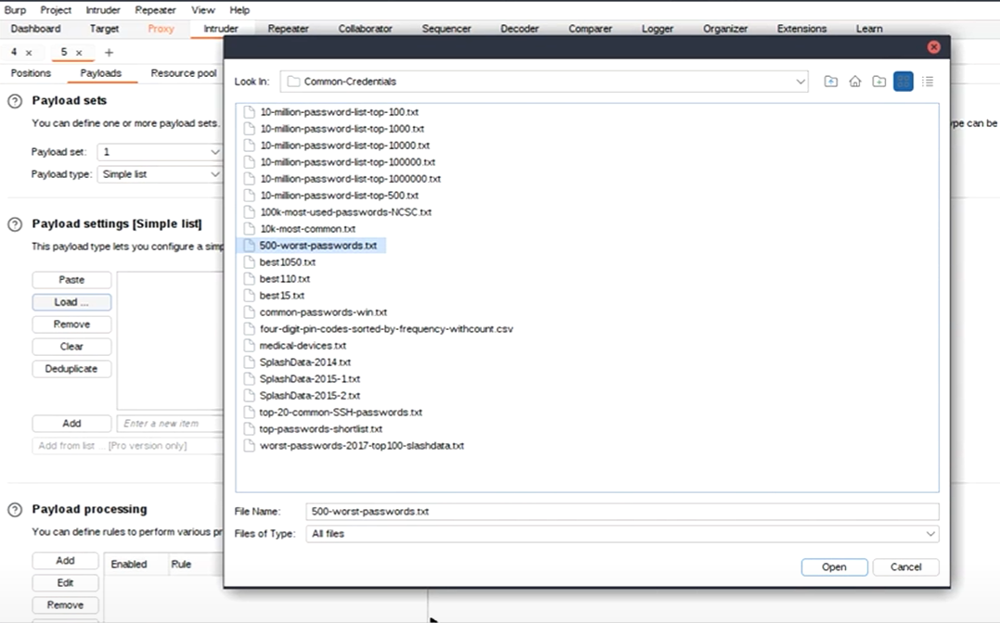

  

  

---

# Enumeration & Brute Force Simulation

## Overview
This project involved completing the Enumeration & Brute Force room on TryHackMe, where I applied various enumeration techniques and brute force attacks to exploit vulnerabilities in web applications. The exercise provided hands-on experience in identifying potential security flaws and gaining unauthorized access through these methods. After this project, I have a better understanding of website security coding, how common brute force attacks are conducted, how vulnerable HTTP is compared to HTTPS, and how easily a system can be exploited if vulnerabilities are present.

## Tools Used
- Burp Suite
- Python
- Crunch
- Intruder
- Linux OS
- Ubuntu

---

## Objectives
Method 1 - **Enumeration in Authentication Forms:** Identify valid email addresses using enumeration techniques. 

Method 2 - **Exploiting Predictable Tokens:** Brute force vulnerable tokens to reset a password and gain access. 

Method 3 - **Exploiting HTTP Basic Authentication:** Using Burp Intruder to exploit Authorization header strings to assist with brute force attacks.

---

## Project Conclusion

This simulation created by TryHackMe (THM) gave me valuable knowledge and experience with enumeration and brute force attacks. After hands-on training with network security concepts, common attack methods, and identifying security flaws, THM gave me a better understanding of how to apply appropriate mitigation strategies, especially in coding.

---

## Method 1: Enumeration in Authentication Forms

1. **Navigate to the Enumeration Lab:**
   - URL: http://enum.thm/labs/verbose_login/
   

2. **Input Incorrect Email Address:**
   - Enter an invalid email address to observe the error message
  
3. **Use Burp Suite:**
   - Exploit system informing us that the username entered isn't in the database
   - Download commonly used email addresses as usernames in list format
     
   - Use the provided Python script in Ubuntu Linux to check for valid email addresses
     - Command: python3 script.py usernames_gmail.com.txt
     

4. **Record Valid Email Address:**
   - Answer: **canderson@gmail.com**
   

## Method 1 Conclusion
By identifying a valid email address in a database, I now have the information I need to continue further attacks. In this scenario, "C. Anderson" (not sure why I keep running into this same fake user in simulations) would now be my target. I could now target this user in phishing campaigns, attempt credential stuffing if I can find leaked credentials, or attempt to password crack from brute force or after building a researched user profile.

## Method 2: Exploiting Predictable Tokens

1. **Navigate to the Predictable Tokens Lab:**
   - URL: *http://enum.thm/labs/predictable_tokens/*

2. **Password Reset Process using Burp Suite:**
   - Use Burp Suite to capture the request and send it to the *Intruder*
   - Enter *admin@admin.com* in email input field, then click *Submit*

3. **Capture and Analyze the Token:**
     

4. **Generate Brute Force Payload:**
   - Use Crunch to create a list of numbers from 100 to 200
   - Command: *crunch 3 3 -o otp.txt -t %%% -s 100 -e 200*
     

5. **Configure Intruder and Launch Attack:**
   - Load the generated payload file (*otp.txt*) in *Intruder* then start attack
     

6. **Analyze Successful Response:**
   - Identify response with largest content length (size should be larger as well) indicating successful token
   - Use obtained token to reset password and login
     
     
7. **Log in with the New Password:**
     

8. **Record Answer:**
   - Answer: **THM{50_pr3d1ct4BL333!!}**
     

     
## Method 2 Conclusion
Method 2 demonstrated how a weak or easily predictable token can be exploited to gain unauthorized access to a system. This simulated attack shows how important penetration testing is. With just a small amount of training, bad actors will exploit improper coding.

---

## Method 3: Exploiting HTTP Basic Authentication

1. **Navigate to the Basic Authentication Lab:**
   - URL: *http://enum.thm/labs/basic_auth/*

2. **Input Credentials:**
   - Input any username and password in pop up and capture Basic Auth request w/ Burp
   

3. **Capture the Request:**
   - Encoded login credentials will be in the HTTP Request Header
   

4. **Decode the Base64 String:**
   - In Burp Intruder, go to the *Positions* tab and decode the base64 encoded string in the Authorization header
     
     

5. **Configure Payloads:**
   - Go to *Payloads* tab and set payload type to Simple list
   - Select the provided wordlist (*500-worst-passwords.txt*)
     

6. **Add Payload Processing Rules:**
   - Add the first rule to automatically add a username to the password
     
   - Add the second rule to base64 encode the combined username and password from the supplied list
     

7. **Launch the Attack:**
   - Go back to the *Positions* tab and click the *Start Attack* button

8. **Analyze Successful Response:**
   - Identify the request with a Status code 200, which indicates a successful brute force attempt
     
   - Decode the encoded base64 string in the successful request
     
   - Use the decoded base64 string to log into the application
     

9. **Record the Flag:**
   - Flag: `THM{b4$$1C_AuTTHHH}`
     
  
## Method 3 Conclusion
Method 3 targeted HTTP (Hypertext Transfer Protocol) vulnerabilities which is a more direct approach to acquiring a user's login credentials. This attack gave me insight into why HTTPS is favored over HTTP due to HTTP containing authentication in its' header string and by only encoding a user's credentials in base64 encoding.
