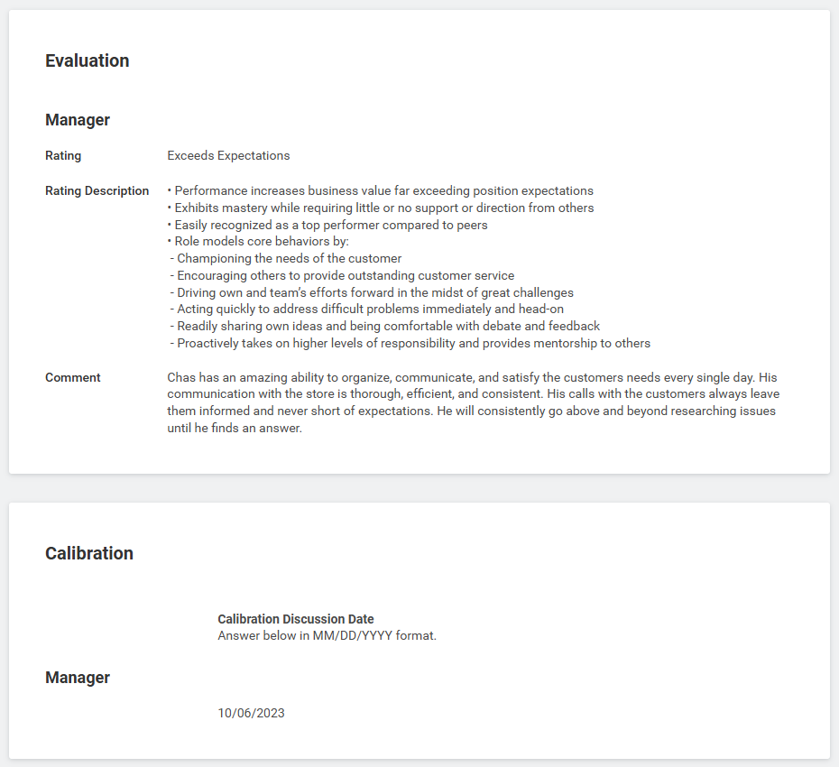

  

  

---

# Accomplishments and Performance Reviews
**Company:*** Lowe’s
**Job Title:** Delivery Coordinator  
**Dates Employed:** June 2022 - Present 

## **Awards and Accomplishments**
- Received **72 Personal Performance Recognitions** of Achievement from Management and Peers.
- Awarded **5 Career Performance Badges**: Delivering Results, Focusing on Customers, Showing Courage, Continuous Learning, and Taking Action.
- Achieved multiple **Manager Performance Evaluation Ratings** of “Exceeds Expectations.”
- Entrusted by management to determine my own schedule due to my dependability.

---
## Personal Performance Review #1
**Evaluation Date:** 10/06/2023
**Evaluation Rating:** Exceeds Expectations
**Manager Evaluation Conducted by:** Back-End Dept Supervisor

---

## Personal Performance Review #2
**Evaluation Date:** 10/30/2024
**Evaluation Rating:** Exceeds Expectations
**Manager Evaluation Conducted by:** Back-End Dept Supervisor

