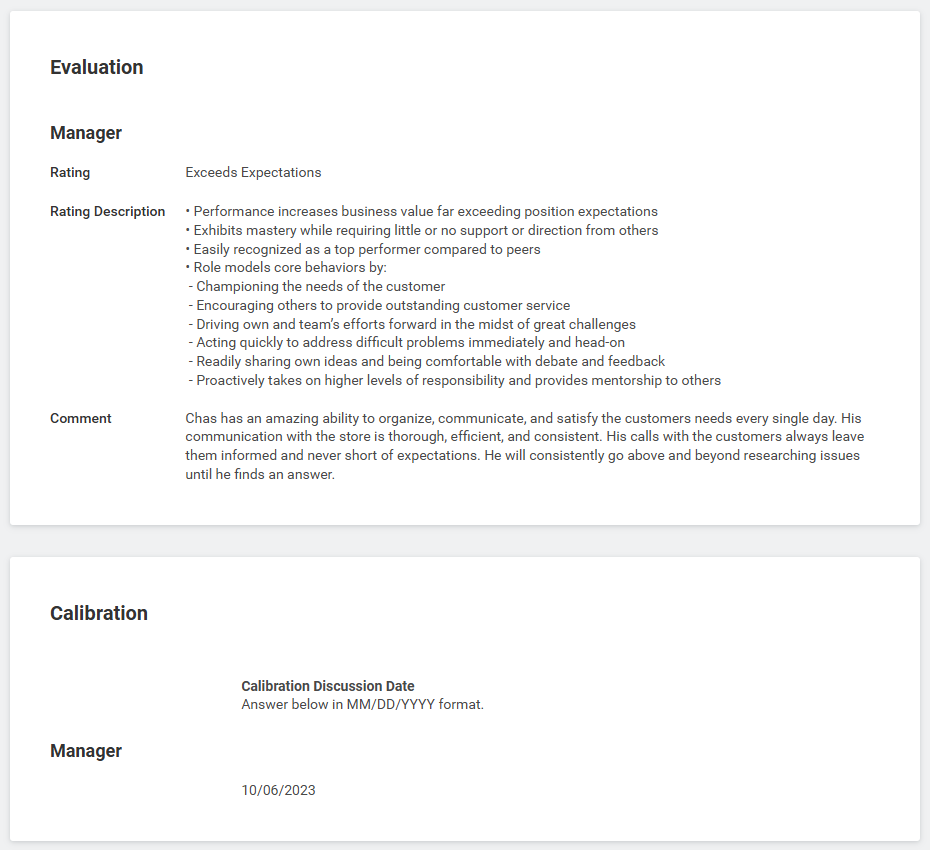
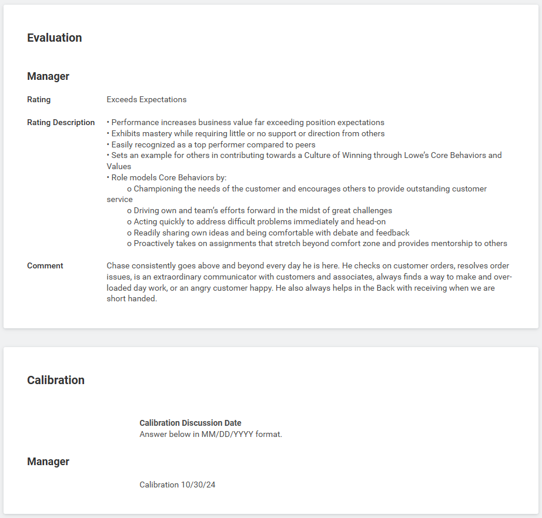

  

  

--- 

# Delivery Coordinator
### *Lowe’s* 
### June 2022 - Present

--- 

## **Experience**
- Primary point of contact for our customers, product specialists, multiple delivery teams, corporate management, vehicle technicians, third-party contractors, vendors, and installation teams.
- Provide timely and effective communication regarding delivery inquiries, updates, order complications, and numerous other inquiries within the scope of my position.
- Planned, optimized, and maintained complex delivery routes for multiple delivery teams with different workloads and capabilities to minimize delivery times and costs, contributing to overall operational efficiency.
- Verifying accuracy of orders and ensuring correct products are shipped, maintaining a high level of order fulfillment accuracy for company products valued over $1 million+.
- Maintain delivery records, update the status of orders, and generate management-level reports.
- Ensured compliance with safety regulations, delivery policies, and procedures, contributing to safe and efficient delivery operations.

## **Awards and Accomplishments**
- **Primary point of contact for management** to address software malfunctions, develop solutions, and create workarounds to ensure the completion of high-priority tasks, preventing operational delays.
- Received **72 Personal Performance Recognitions** of Achievement from Management and Peers.
- Through my own volition, I **developed a new Standard Operating Procedure/Operational Playbook**.
Utilizing the internal Operational Management System, I consolidated numerous identification barcodes into a single accessible chart/list, resulting in significant time savings and improved efficiency.
- Awarded **5 Career Performance Badges**: Delivering Results, Focusing on Customers, Showing Courage, Continuous Learning, and Taking Action.
- Achieved multiple Manager Performance Evaluation Ratings of **“Exceeds Expectations”**.
- Due to my reliability, management entrusts me to determine my own weekly schedule.

---
## Performance Evaluation #1
**Evaluation Date:** 10/06/2023
**Evaluation Rating:** Exceeds Expectations
**Manager Evaluation Conducted by:**  Back-End Dept Supervisor 

---

## Performance Evaluation #2
**Evaluation Date:** 10/30/2024 
**Evaluation Rating:** Exceeds Expectations 
**Manager Evaluation Conducted by:**  Back-End Dept Supervisor 

