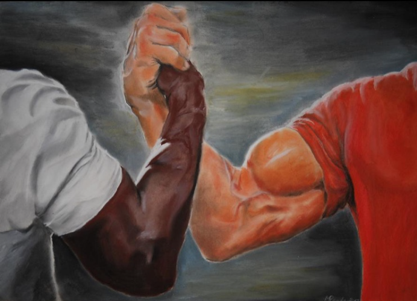

# Introduction
When it comes to both my personal life and professional career, I hold myself to a high standard. At my core, I am a morally driven and objective-focused person. I hold a deep curiosity and passion for cybersecurity and it takes up most of my free time. I believe knowledge, moral character, and mental resilience are what separate us from the bad actors who intend to ruin the lives of everyday individuals. I also believe that helping and protecting those who are unable to protect themselves is a fundamental duty. As a father, husband, teammate, or even a passerby, protective altruism drives me to safeguard those around me.

# Career Objective
Through the mentorship of exceptional leaders and the shaping of my methodologies from the insightful subordinates I was privileged to lead, I have developed a growth-focused mindset. I believe that we should always seek to be better than we were the day prior. That our work reflects our character, and that we should always strive to surround ourselves with those who want others to succeed just as much as they themselves want success. For these reasons, I am seeking employment with an organization that prioritizes excellence and societal betterment.

# [Professional Development](Projects/Education.md)
- ## Master of Science in Information Technology  
  - *Purdue University - West Lafayette, IN*
  - Emphasis: Cybersecurity
  - Expected Completion Date: September 09, 2026
  - Courses Overview
- ## Bachelor of Applied Science in Cyber Operations  
  - *University of Arizona - Tucson, AZ*
  - Emphasis: Defense and Forensics
  - Acquired: December 20, 2024
  - Courses Overview
- ## Certificates/Courses

# Portfolio Projects
## Penetration Testing
- Scenario 1: [CyberApolis Water Company Breach](Projects/Pen-Testing/Water-Company.md)

## Digital Forensics
- Scenario 1: [Corporate Network Cybersecurity Breach Investigation](Projects/Forensics/scenario-1.md)
- Scenario 2: [Digital Forensic Analysis and Suspect Linkage](Projects/Forensics/scenario-2.md)
- Scenario 3: [Investigating Insider Threat through Email Analysis](Projects/Forensics/scenario-3.md)
- Scenario 4: [Investigation of Identity Theft and Bank Heist Plot](Projects/Forensics/scenario-4.md)

## Digital Reconnaissance
- [Digital Profiling 1: Tim](Projects/Recon/tim.md)
- [Digital Profiling 2: Sarah](Projects/Recon/sarah.md)
- [Digital Profiling 3: John](Projects/Recon/john.md)

## Network Architecture
- [Home Network Setup](Projects/Network/scenario-1.md)
- 

## Scripting and Automation for Threat Mitigation
- 
- 

## Social Engineering & Cyber Deception
- [Sock Puppet Creation](Projects/Deception/create.md)
- [Sock Puppet Detection](Projects/Deception/detect.md)

# 🤜🤛 Connect with me  

{:target="_blank"} 
{:target="_blank"} 
{:target="_blank"}  
{:target="_blank"} 
{:target="_blank"}

{:target="_blank"}
